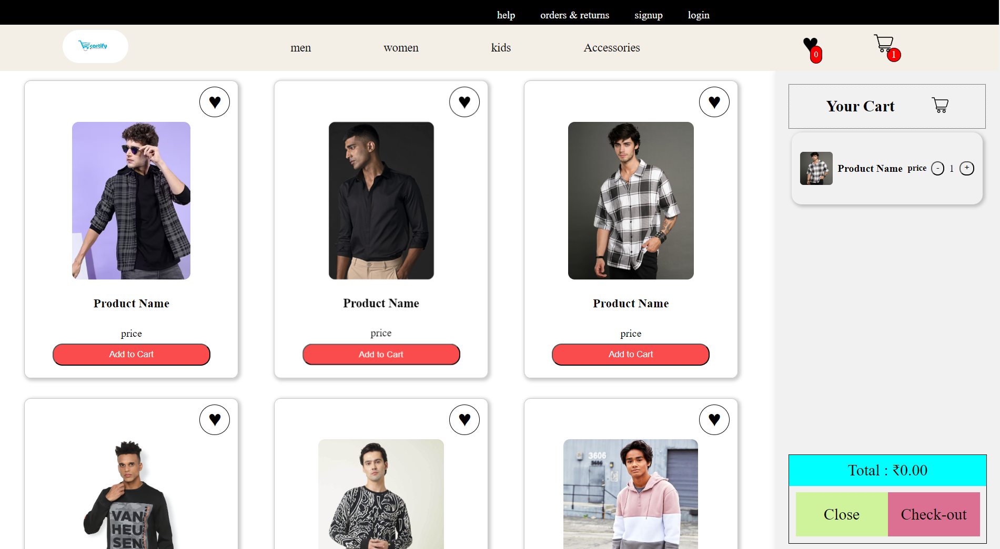

# E-Commerce Application

This is a simple e-commerce web application built using HTML, CSS, and JavaScript. It includes features like adding products to cart, adding to wishlist, removing from cart, and filtering products based on categories such as men, women, and accessories.

## Features

- **Add to Cart**: Users can add products to their shopping cart.
- **Add to Wishlist**: Users can add products to their wishlist.
- **Remove from Cart**: Users can remove products from their cart.
- **Filter Products**: Products can be filtered based on categories like men, women, kids, and accessories.

## Technologies Used

- HTML
- CSS
- JavaScript

## Setup Instructions

To run this application locally:

1. Clone the repository:
   ```bash
   git clone (https://github.com/cherry-1729-9090/EcommerceShopWebsite.git)
   ```

2. Navigate to the project directory:
   ```bash
   cd ecommerceShop
   ```

3. Open `index.html` in your web browser.

## Screenshots
- Cart


- WishList
 

## Contributing

Pull requests are welcome. For major changes, please open an issue first to discuss what you would like to change.

## License

This project is licensed under the MIT License - see the [LICENSE](LICENSE) file for details.

